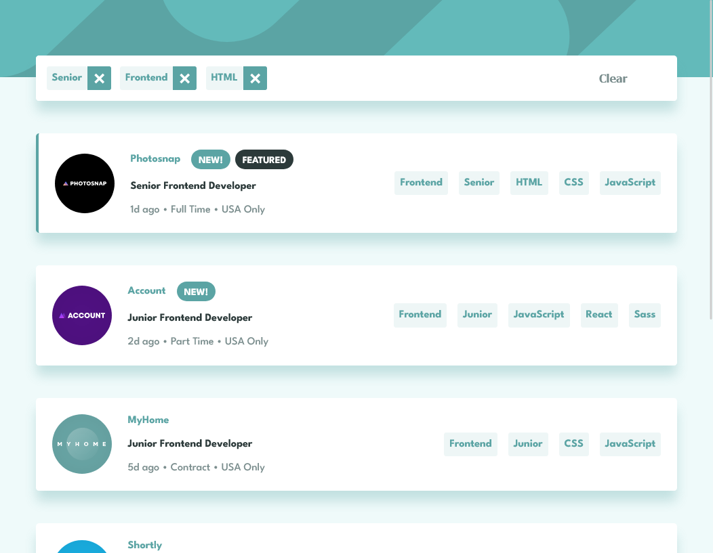
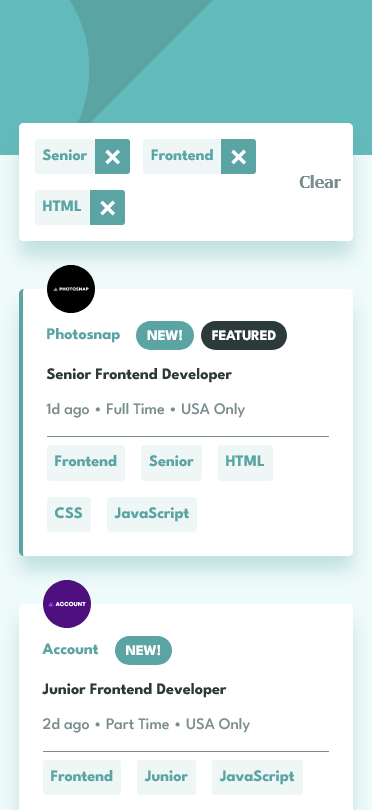

# Frontend Mentor - Job listings with filtering solution

This is a solution to the [Job listings with filtering challenge on Frontend Mentor](https://www.frontendmentor.io/challenges/job-listings-with-filtering-ivstIPCt). Frontend Mentor challenges help you improve your coding skills by building realistic projects.

## Table of contents

- [Overview](#overview)
  - [The challenge](#the-challenge)
  - [Screenshot](#screenshot)
  - [Links](#links)
- [My process](#my-process)
  - [Built with](#built-with)
  - [What I learned](#what-i-learned)
  - [Continued development](#continued-development)
- [Acknowledgments](#acknowledgments)

## Overview

### The challenge

Users should be able to:

- View the optimal layout for the site depending on their device's screen size
- See hover states for all interactive elements on the page
- Filter job listings based on the categories

### Screenshot

<p float="left">
  
  
</p>

### Links

- Solution URL: [https://www.frontendmentor.io/solutions/staticjoblistings-react-solution-eseYkgAV61](https://www.frontendmentor.io/solutions/staticjoblistings-react-solution-eseYkgAV61)
- Live Site URL: [https://reversalgm.github.io/static-job-listings/](https://reversalgm.github.io/static-job-listings/)

## My process

### Built with

- React
- Vite
- CSS custom properties
- CSS media queries
- Flexbox
- Mobile-first workflow
- Fluid design

### What I learned

Flexbox is used for layouts inside the card and the list of cards. Since the layout is responsive, media queries are only used to change the layout from mobile to desktop at the 700px breakpoint.
CSS custom properties are used for colours that repeat throughout the design. 
Negative margins and relative positioning are used to shift up the filter box.

```
.filter__container {
  position: relative;
  top: -2rem;
  width: 90%;
  margin: 0rem auto -2rem;
}
```

### Continued development

The filter component can be improved so that users can select filters from a list instead of only from job listings. There can also be additional filter options like match any, match all, etc.

## Acknowledgments
GitHub Actions script used to deploy to GitHub pages:
https://www.youtube.com/watch?v=dR9Swhw0L50
https://github.com/benixal/benixal.github.io/blob/main/.github/workflows/deploy.yml
